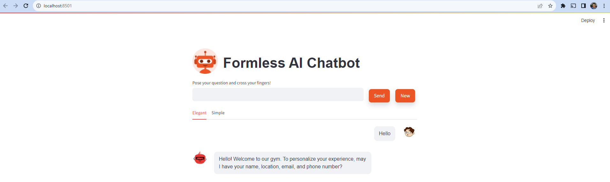

<h1> Formless AI Chatbot</h1>

<h2>Objective</h2>
Inspired by Typeform's chat feature, especially Formless AI's user data collection approach, we
aim to create an interactive conversational chatbot that actively engages users while discreetly
handling data collection.

<h2> Key Features </h2>

* Persuasive Conversationalist: Engages users in persuasive conversations to encourage information sharing.

* Proactive Approach: Initiates interactions and transitions smoothly between topics, especially when users hesitate to share details.

* Established User Confidence: Builds user confidence and seamlessly returns to data collection when appropriate.

* Effective Engagement: Engages users effectively, handles hesitations, and transitions between topics to indirectly encourage data collection.

* Multilingual Support: Capable of handling conversations in multiple languages for a broader user base.

* Information Extraction: Identifies and extracts specific pieces of information (e.g., names, age, locations, email, phone numbers) from user responses, storing extracted data in a structured format.

<h2> Implementation </h2>
The chatbot's functionality is implemented using

* Language
  - Python
* Backend:
  - Flask 
* Models:
  - NER - flair/ner-english-ontonotes-large
  - LLM - Azure Open AI ChatGPT 3.5 Turbo 
* Frontend:
  - Streamlit

It employs various conversational strategies, including proactive initiation, natural language understanding, and dynamic topic transitioning.

Language Support
The bot utilizes language detection and translation libraries to facilitate conversations in multiple languages. Users can seamlessly communicate in their preferred language.

Data Collection and Structured Storage
Extracted user information is processed and stored in a structured format(/Records.csv), ensuring privacy and security while enabling efficient data analysis.

<h2> Usage </h2>
To use the chatbot, follow these steps:

1. Clone Repository: Clone this repository to your local environment.
2. Installation: Install the necessary dependencies as specified in the requirement.txt.
3. Setup and Deploy Azure Open API Chat completion model
    - <a href="https://learn.microsoft.com/en-us/azure/ai-services/openai/how-to/create-resource?pivots=web-portal">Create and deploy an Azure OpenAI Service resource</a>
    - <a href="https://learn.microsoft.com/en-us/azure/ai-services/openai/chatgpt-quickstart?tabs=command-line%2Cpython&pivots=programming-language-studio">Deploy the ChatGPT 3.5 Turbo model using the instruction and save the necessary keys</a>
4. Replace the keys in .env files 
```py
API_TYPE = "azure"
API_BASE = "https://p1-azureopen-ai.openai.azure.com/"
API_VERSION = "2023-07-01-preview"
API_KEY = ""
```
5. Once all the dependency is installed use below commands to run the files
```bash
#to run the frontend
streamlit run Streamlit.py 
```
```bash
#to run the Backend
python main.py 
```
<h2> Preview </h2>

